# qelectrotech-element-contrib
Duplicate elements but with different manufacturer references have been discarded on official collection and made available on this Github repository.
[collection viewer](https://download.qelectrotech.org/qet/elements_contrib/index.html)
Adding some elements I use to update the documentation while renovating the house. Mainly using Wago and Hager components.
I will add also some elements for the new smarthome using mainly Shelly products.

__NOTE: due to the scale change and the exact units in all cabinet graphics I would recommend to set the grid in X direction to 9 instead of 10. The horizontal pitch for a unit is 18 mm  and therefore every grpahic element with a unit width of 1 HP ( or 1TE in german ) is exaclty 36 pixels in width.__

## Changes

### 2024-01-22
* reflect scale changes to Hager quick connect terminals
* added missing Hager quick connect terminals
  Overview and datasheets [Hager QuickConnect] (https://hager.com/uk/search?q=QuickConnect)

### 2024-01-19
* had to resize the graphic components to reflect the scale change.
* added some missing Hager circuit breaker and RCD.
* added the old Hager System SL80 - F91 board
* added the old Hager System SL80 - F92 board
* added the old Hager System SL80 - F93 board

## Preview
### Hager QuickConnect Series KN

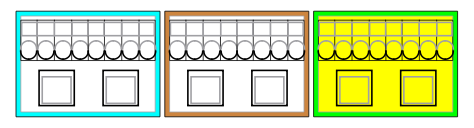
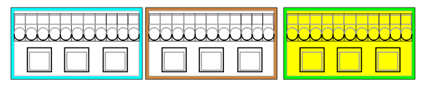

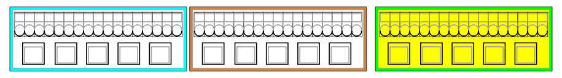
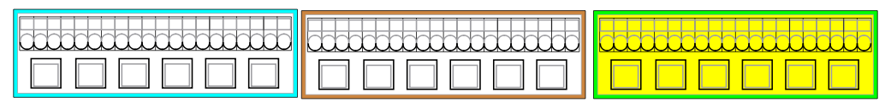
### Hager Circuit Breaker - Series MBN
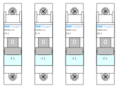
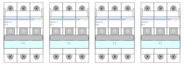
### Hager Residual Current Protective Device (RCD) - Series CDA
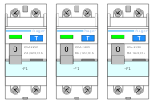
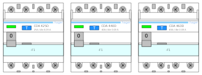
### Shelly
### Shelly Gen 1
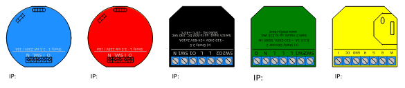
### Shelly 3EM

### Shelly Plus Line
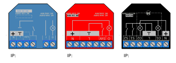
### Shelly Pro Line
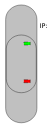
### ABB - Main Switch
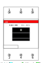
### Hensel
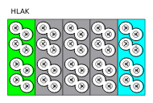
